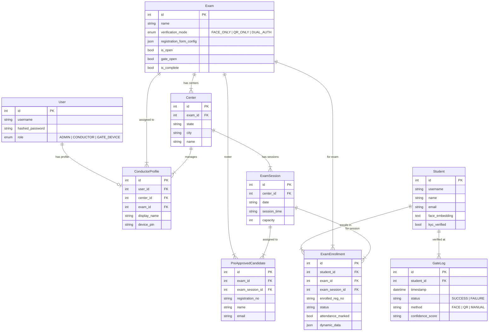

# Digi-Exam PoC — Project Architecture

## System Overview

Digi-Exam is a biometric examination verification platform built with **FastAPI + SQLAlchemy + InsightFace**. 

**Architectural Paradigm (Non-Microservices):**
The project relies on a monolithic Hub-and-Spoke model rather than a distributed cloud microservices architecture. It follows a **Central Server + Edge Terminal** architecture enabling both online and fully offline student identity verification at exam centers. The central backend operates as a monolith, while edge terminals run as independent, occasionally-connected state machines.

```
┌─────────────────────────────────────────────────────────────────────────┐
│                        CENTRAL SERVER (:8000)                          │
│   Admin Dashboard · Conductor Management · Student Registration       │
│   Exam Creation · Roster Upload · QR Hall Tickets · Package Export    │
└──────────────────────────────┬──────────────────────────────────────────┘
                               │ .digipack (HMAC-signed JSON)
                               ▼
┌─────────────────────────────────────────────────────────────────────────┐
│                     EDGE TERMINAL (:8200)                              │
│   Offline Face Verification · Candidate Roster · Gate Logs · Sync     │
│   Runs independently at exam center — no internet required            │
└─────────────────────────────────────────────────────────────────────────┘
```

---

## Directory Structure

```
Digi_exam_poc/
├── main.py                    # Central server — all API routes & page views
├── models.py                  # SQLAlchemy ORM models (Exam, Center, Session, Student, etc.)
├── database.py                # Async SQLAlchemy engine & session factory
├── dependencies.py            # Auth middleware (JWT cookie extraction)
├── requirements.txt           # Python dependencies
├── run.bat                    # Quick-start script
├── digiexam.db                # SQLite database (auto-created)
│
├── services/
│   ├── auth.py                # JWT token creation, password hashing (bcrypt)
│   ├── face.py                # InsightFace embedding extraction & cosine matching
│   └── email_service.py       # Hall ticket email dispatch (mock filesystem)
│
├── templates/                 # Jinja2 HTML templates (Tailwind CSS)
│   ├── base.html              # Shared nav layout
│   ├── login.html             # Unified login (Admin / Conductor / Student)
│   ├── register.html          # Student profile creation + face capture
│   ├── student_dashboard.html # Student exam enrollment + QR upload
│   ├── enroll.html            # Exam-specific enrollment form
│   ├── admin_dashboard.html   # Exam creation (form + JSON upload)
│   ├── admin_students.html    # Student profile management
│   ├── admin_roster.html      # CSV roster upload for pre-approved candidates
│   ├── admin_attendance.html  # Attendance tracking & gate controls
│   ├── admin_monitor.html     # Live exam monitoring
│   ├── admin_conductors.html  # Conductor CRUD (assign center + device PIN)
│   ├── conductor_dashboard.html # Conductor view — gate open/close, stats
│   └── gate_entry.html        # (Legacy — replaced by Edge Terminal)
│
├── static/                    # CSS, JS, uploaded photos
├── uploads/                   # Student face photos (temporary)
├── mock_sent_emails/          # Simulated email output (JSON files)
│
├── sample_exam.json           # Example exam definition with centers & sessions
├── sample_roster.csv          # Example candidate roster CSV
│
└── edge_terminal/             # STANDALONE offline gate application
    ├── app.py                 # FastAPI app — package loading, verification, sync
    ├── db.py                  # SQLite local log storage (edge_terminal_logs.db)
    ├── verifier.py            # InsightFace CPU-optimized face matching engine
    ├── requirements.txt       # Edge-specific dependencies
    └── templates/
        ├── login.html         # Two-step login (load package → enter PIN)
        ├── gate.html          # Face verification terminal (webcam + reg no)
        ├── roster.html        # Candidate roster viewer (search + filter)
        └── sync.html          # Upload verification logs back to central server
```

---

## Data Model (Entity Relationships)



---

## Core Workflows

### 1. Exam Setup (Admin)
```
Admin creates Exam (via form or JSON upload)
  → Defines Centers (state, city, name)
    → Defines Sessions per center (date, time, capacity)
      → Uploads CSV Roster of pre-approved candidates
        → System generates QR-coded Hall Tickets per candidate
```

### 2. Student Enrollment
```
Student registers profile → captures face photo → embedding stored
  → Logs in → selects open exam → uploads Hall Ticket QR
    → System decodes QR → matches reg_no to roster
      → Cross-checks assigned session → auto-approves enrollment
```

### 3. Conductor & Edge Deployment
```
Admin creates Conductor → assigns Center + Device PIN
  → Conductor logs into Central Server → downloads .digipack
    → .digipack contains: exam metadata + candidate roster + face embeddings + device PIN
      → HMAC-SHA256 signed for tamper detection
```

### 4. Offline Gate Verification (Edge Terminal)
```
Conductor loads .digipack into Edge Terminal → logs in with Username + PIN
  → Student approaches gate → enters Reg No → webcam captures face
    → InsightFace extracts embedding → cosine similarity vs stored embedding
      → Score ≥ 0.45 → PASS (attendance marked) | Score < 0.45 → FAIL
        → All logs stored locally in SQLite → batch-synced to Central Server later
```

---

## Security Architecture

| Layer | Mechanism |
|---|---|
| **Authentication** | JWT tokens in HTTP-only cookies (Admin/Conductor/Student) |
| **Password Storage** | bcrypt hashing via passlib |
| **Package Integrity** | HMAC-SHA256 signature on `.digipack` payload |
| **Edge Terminal Auth** | Conductor username + Admin-assigned Device PIN |
| **Biometric Privacy** | Only 512-dim embeddings stored, never raw face images |
| **Role-Based Access** | `ADMIN`, `CONDUCTOR`, `GATE_DEVICE` enum roles |

---

## Technology Stack

| Component | Technology |
|---|---|
| **Backend Framework** | FastAPI (async) |
| **ORM** | SQLAlchemy 2.0 (async) |
| **Database** | SQLite (dev) / PostgreSQL (prod-ready) |
| **Face Recognition** | InsightFace (ArcFace model, buffalo_l) |
| **QR Code** | qrcode (generation) + OpenCV (detection/decoding) |
| **Templates** | Jinja2 + Tailwind CSS (CDN) |
| **Auth** | python-jose (JWT) + passlib (bcrypt) |
| **Server** | Uvicorn (ASGI) |

---

## Deployment Topology

```
┌──────────────────────────────┐
│     CENTRAL SERVER           │
│  uvicorn main:app            │
│  --host 0.0.0.0 --port 8000  │
│  --reload                    │
│                              │
│  Database: digiexam.db       │
│  Face Engine: InsightFace    │
└──────────────┬───────────────┘
               │
    ┌──────────┴──────────┐
    │  .digipack export   │
    │  (USB / LAN / WiFi) │
    └──────────┬──────────┘
               │
    ┌──────────▼──────────────────┐     ┌──────────▼──────────────────┐
    │   EDGE TERMINAL #1          │     │   EDGE TERMINAL #2          │
    │   Center: CDAC Juhu         │     │   Center: CDAC Kharghar     │
    │   uvicorn app:app           │     │   uvicorn app:app           │
    │   --host 0.0.0.0            │     │   --host 0.0.0.0            │
    │   --port 8200               │     │   --port 8200               │
    │                             │     │                             │
    │   Runs FULLY OFFLINE        │     │   Runs FULLY OFFLINE        │
    │   Logs: edge_terminal_logs  │     │   Logs: edge_terminal_logs  │
    └─────────────────────────────┘     └─────────────────────────────┘
```

---

## API Endpoints Summary

### Central Server (`main.py`)

| Method | Endpoint | Role | Purpose |
|---|---|---|---|
| `POST` | `/api/login` | Public | JWT authentication |
| `POST` | `/api/register` | Public | Student profile creation |
| `POST` | `/api/admin/exam` | Admin | Create exam with centers & sessions |
| `GET` | `/api/admin/exams` | Admin | List all exams |
| `POST` | `/api/admin/roster/{exam_id}` | Admin | Upload CSV candidate roster |
| `GET` | `/api/admin/conductors` | Admin | List conductors |
| `POST` | `/api/admin/conductors` | Admin | Create conductor + device PIN |
| `GET` | `/api/admin/exam/{id}/export_package` | Conductor | Download signed `.digipack` |
| `POST` | `/api/student/enroll/{exam_id}` | Student | Enroll via Hall Ticket QR |
| `POST` | `/api/admin/exam/{id}/sync_logs` | Edge | Receive synced gate logs |

### Edge Terminal (`edge_terminal/app.py`)

| Method | Endpoint | Purpose |
|---|---|---|
| `POST` | `/api/load_package` | Load & verify `.digipack` |
| `POST` | `/api/verify` | Face verification at gate |
| `GET` | `/api/logs` | Retrieve local verification logs |
| `POST` | `/api/upload_logs` | Batch sync logs to central server |
| `GET` | `/roster` | View loaded candidate roster |
| `GET` | `/sync` | Sync dashboard |
